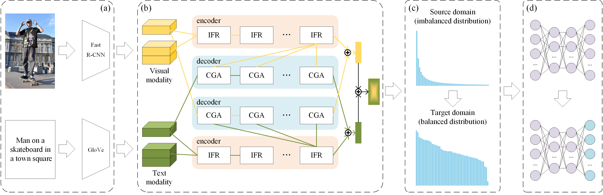

# Enhancing scene graph generation via Hybrid Co-Attention and Predicate Reweighting for long-tail robustness (ReBalance-HCA)

## Description

This is the PyTorch implementation for **ReBalance-HCA** proposed in the paper **Enhancing scene graph generation via Hybrid Co-Attention and Predicate Reweighting for long-tail robustness**. The scene graph generation task aims to generate a set of triplet <subject, predicate, object> and construct a graph structure for an image. The system supports multiple evaluation modes including Predicate Classification (PredCls), Scene Graph Classification (SGCls), and Scene Graph Detection (SGDet).

## Architecture



## Dataset Information
The system supports **Visual Genome Dataset** datasets for scene graph generation:
* Used as the primary dataset for training and evaluation
* Requires GloVe embeddings for semantic processing
* Dataset path configuration through GLOVE_DIR ./datasets/vg/

The following is adapted from [Danfei Xu](https://github.com/danfeiX/scene-graph-TF-release/blob/master/data_tools/README.md) and [neural-motifs](https://github.com/rowanz/neural-motifs).

Note that our codebase intends to support attribute-head too, so our ```VG-SGG.h5``` and ```VG-SGG-dicts.json``` are different with their original versions in [Danfei Xu](https://github.com/danfeiX/scene-graph-TF-release/blob/master/data_tools/README.md) and [neural-motifs](https://github.com/rowanz/neural-motifs). We add attribute information and rename them to be ```VG-SGG-with-attri.h5``` and ```VG-SGG-dicts-with-attri.json```. The code we use to generate them is located at ```datasets/vg/generate_attribute_labels.py```. Consistent with the conventional approach described in 'Unbiased Scene Graph Generation from Biased Training', we disable the attribute head during detector pretraining and relationship prediction to ensure fair comparison, mirroring this codebase's default configuration.

### Download:
1. Download the VG images [part1](https://cs.stanford.edu/people/rak248/VG_100K_2/images.zip) [part2](https://cs.stanford.edu/people/rak248/VG_100K_2/images2.zip). Extract these images to the file `datasets/vg/VG_100K`. If you want to use other directory, please link it in `DATASETS['VG_stanford_filtered']['img_dir']` of `maskrcnn_benchmark/config/paths_catelog.py`. 
2. Download the [scene graphs](https://onedrive.live.com/embed?cid=22376FFAD72C4B64&resid=22376FFAD72C4B64%21779871&authkey=AA33n7BRpB1xa3I) and extract them to `datasets/vg/VG-SGG-with-attri.h5`, or you can edit the path in `DATASETS['VG_stanford_filtered_with_attribute']['roidb_file']` of `maskrcnn_benchmark/config/paths_catelog.py`.

### Dataset Setup 
Follow the [instructions](https://github.com/KaihuaTang/Scene-Graph-Benchmark.pytorch) to install and use the code. Follow some [scripts](https://github.com/ZhuGeKongKong/SSG-G2S/tree/main/scripts) for training and testing.
The training process is divided into two stages: **Training the common SGG model** and **Finetuning the informative SGG model**.

## Code Information
The codebase is built on the MaskRCNN-Benchmark framework and includes:

### Core Components:
1. Transformer Predictors: Multiple transformer-based relation prediction models
2. Relation Head: Complete relation detection pipeline
3. Data Loaders: Custom dataset handling with resampling support

### Key Models:
* TransformerTransferPredictor: Main relation prediction model
* Clean Classifier: Bias-aware classification component
* Transfer Classifier: Domain adaptation capabilities

## Usage Instructions
### Training
Use the provided training scripts with different configurations:

#### For Predicate Classification:
```bash
bash scripts/train.sh 0  # PredCls mode
```
#### For Scene Graph Classification:
```bash
bash scripts/train.sh 1  # SGCls mode
```
#### For Scene Graph Detection:
```bash
bash scripts/train.sh 2  # SGDet mode
```

### Testing
Execute evaluation using the test scripts:

```bash
bash scripts/test.sh 0  # Test PredCls  
bash scripts/test.sh 1  # Test SGCls    
bash scripts/test.sh 2  # Test SGDet
```

## Requirements
### Dependencies:
* Python 3.8
* PyTorch with CUDA support 2.4.0
* APEX for mixed-precision training
* COCO API for dataset handling

### Environment Setup:
The system requires proper PYTHONPATH configuration including APEX and COCO API paths.

## Materials & Methods
### Computing Infrastructure
* **Operating System**: Linux-based systems
* **Hardware Requirements**: NVIDIA GPUs with CUDA support
* **Distributed Training**: Multi-GPU training support via DistributedDataParallel (optional)

### Data Preprocessing Steps
#### Image Preprocessing Pipeline:
The system applies different preprocessing transforms for training and evaluation phases:

#### Training Transforms:
* Color jittering (brightness, contrast, saturation, hue adjustments)
* Random horizontal flipping (50% probability)
* Random vertical flipping (configurable probability)
* Image resizing with aspect ratio preservation
* Tensor conversion and normalization [build.py:36-45](https://github.com/LinusLing/ReBalance-HCA/tree/main/maskrcnn_benchmark/data/transforms/build.py#L36-L45)

#### Evaluation Transforms:
* No augmentation applied (color jitter and flipping disabled)
* Only resizing, tensor conversion, and normalization applied [build.py:15-23](https://github.com/LinusLing/ReBalance-HCA/tree/main/maskrcnn_benchmark/data/transforms/build.py#L15-L23)

#### Normalization Parameters:
* Pixel mean: [102.9801, 115.9465, 122.7717]
* Pixel standard deviation: [1.0, 1.0, 1.0]
* BGR255 format conversion for compatibility [defaults.py:57-61](https://github.com/LinusLing/ReBalance-HCA/tree/main/maskrcnn_benchmark/config/defaults.py#L57-L61)

#### Dataset Format Requirements:
* PASCAL VOC dataset supported in original format
* Other datasets require conversion to COCO JSON format
* Symlink-based dataset organization for efficient access

### Evaluation Method
The system supports comprehensive evaluation across three main tasks:

1. **Predicate Classification (PredCls)**: Uses ground truth bounding boxes and object labels
2. **Scene Graph Classification (SGCls)**: Uses ground truth bounding boxes, predicts object labels
3. **Scene Graph Detection (SGDet)**: End-to-end detection and relation prediction relation_train_net.py:314-323

### Training Configuration:
* Mixed precision training support
* Warmup learning rate scheduling
* Gradient clipping for training stability
* Validation-based early stopping

## Conclusions
### Limitations

* **Computational Resources Trade-off**  
   While the Hybrid Co-Attention delivers enhanced feature fusion, its iterative refinement process involves moderately increased training time. We recommend leveraging multi-GPU configurations where feasible to optimize throughput.

* **Novel Predicate Handling**  
   The current framework focuses primarily on rebalancing existing predicate distributions. Accommodating entirely new predicates with minimal examples remains an active research direction – users exploring few-shot scenarios may consider supplementary augmentation techniques as interim solutions.

* **Domain Adaptation Scope**  
   For scenarios with significant domain shifts between datasets, note that our current fine-tuning protocol adjusts only the final model layer. This lightweight adaptation strategy favors efficiency, though exceptionally divergent domains might warrant additional network adjustments.

## License & Contribution Guidelines
This implementation is based on [Facebook's MaskRCNN-Benchmark framework](https://github.com/facebookresearch/maskrcnn-benchmark). Users should refer to the original licensing terms and follow standard open-source contribution practices. 
